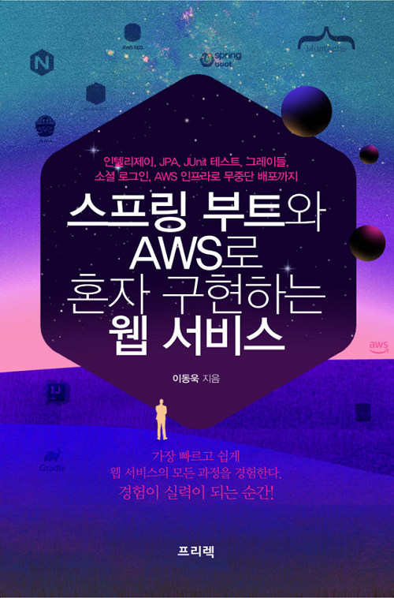

# 자바 스프링 부트 프로젝트

## 도서
</img> 
스프링 부트와 AWS로 혼자 구현하는 웹 서비스

## 개발기간   
기간 : 2020.02.12 ~ 

## 개발 환경
OS : Mac OS Catalina   
Java : 1.8

## 이슈사항
1. gradle 버전이슈
    - gradle 5.* -> 4.*로 변경
2. p.106 (PostsService.java의 postsRepository 에러)
    - Inferred type 'S' for type parameter 'S' is not within its bound; should extend       
    'com.jojoldu.book.springboot.domain.posts.Posts'라는 에러가 발생
    - toEntity 메소드를 만들 때 자동완성 기능을 사용했더니 public Object toEntity()로 만들어졌다.
    - public Posts toEntity()로 만들어야 한다!
3. p.110 PostsApiControllerTest.java error
    - ResponseEntity<Long> responseEntity = restTemplate.postForEntity(url, requestDto, Long.class); 에서 발생
    - 원인 : 저자 실수로 컨트롤러상의 Mapping이 @PutMapping으로 되어있었음.
    - 해결 : @PostMapping으로 변경하니 해결됨.

## 게시판 기능
1. 게시글 조회
2. 게시글 등록
3. 게시글 수정
4. 게시글 삭제

## 회원 기능
1. 구글 / 네이버 로그인
2. 로그인한 사용자 글 작성 권한
3. 본인 작성 글에 대한 권한 관리

